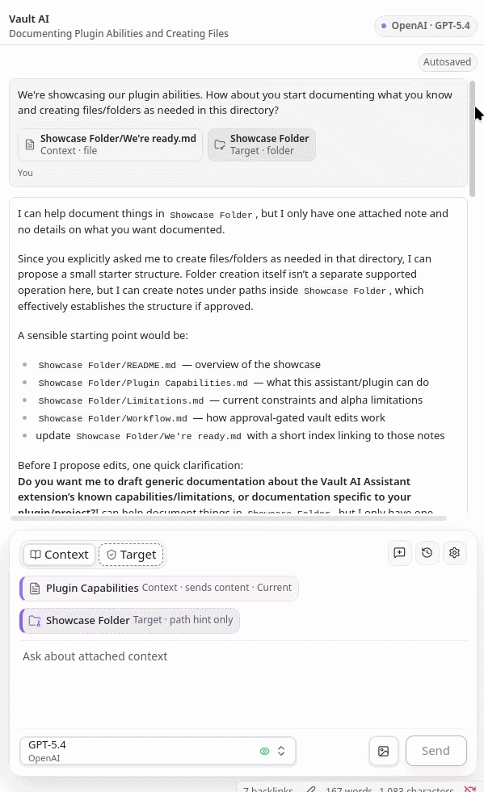
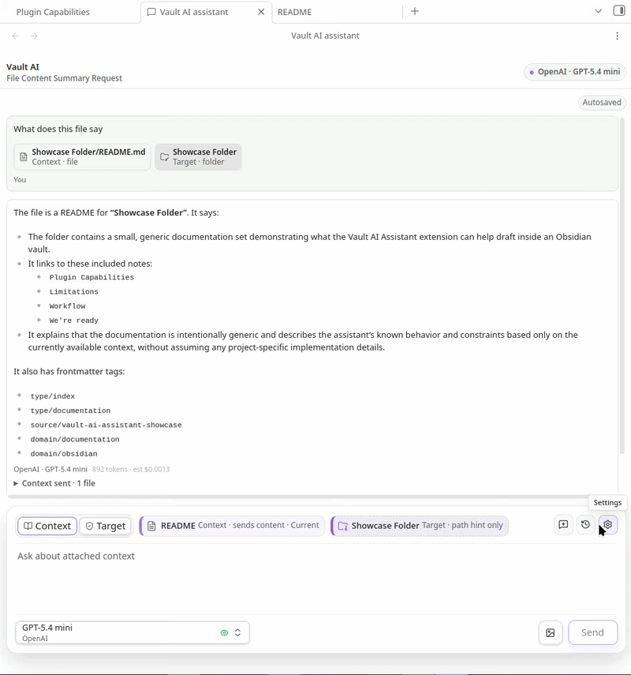

# Vault AI Assistant


Vault AI Assistant is an Obsidian plugin for AI chat grounded in context you explicitly attach. It can answer questions about selected notes, folders, and images, then propose vault file changes for review before anything is written.

This is an alpha release. Use it on a dedicated test vault first, keep backups, and review every proposed file operation before approval.

## Preview

| Sidebar assistant | Editor tab |
| --- | --- |
|  |  |

## What It Does

- Chat with OpenAI or Anthropic models from inside Obsidian.
- Run the assistant in the sidebar or as a regular editor tab.
- Attach notes, folders, the active note, and images as explicit request context.
- Set edit targets so the assistant knows where vault changes should go without silently reading those files or folders.
- Review approval-gated vault operation proposals before writes happen.
- Edit built-in system prompts from markdown files under `vault-ai-assistant/system-prompts`.
- Add custom markdown system prompts by placing files in `vault-ai-assistant/system-prompts`.
- Keep saved chat history locally in the vault under `vault-ai-assistant/conversations`.

## Supported Vault Operations

Vault writes are proposed first and only applied after approval.

| Operation | Supported |
| --- | --- |
| Create folders | Yes |
| Create notes | Yes |
| Modify notes | Yes, with diff review and stale-content checks |
| Append to notes | Yes |
| Delete notes or folders | Yes, with destructive-operation review |
| Move or rename notes/folders | Yes |
| Copy notes | Yes |
| Copy folders | No |

## How Context Works

Vault AI Assistant separates readable context from edit targets.

Readable context is the material the model can inspect. When you attach notes, folders, the active note, or images, that content is included in the provider request so the assistant can use it while answering or drafting a proposal.

Edit targets are path hints for where requested vault changes should happen. A target can be a note, a folder, or the default vault root target shown as `Target /`. Target-only folders and notes do not send hidden file contents to the model unless you also attach them as readable context.

A folder can be used both ways: attach it as context when the assistant needs to read files inside it, or set it as an edit target when you only want to indicate where new or changed files should go. Edit targets are not write permission. Every vault operation still appears as an approval card before it can be applied.

## Safety Model

Vault AI Assistant does not independently search or read your whole vault. The model receives only:

- The current chat message.
- Prior chat messages needed for conversation continuity.
- Notes or folders you explicitly attach as readable context.
- The active markdown note when `Auto attach active note` is enabled.
- Image attachments you explicitly send.
- Non-readable edit target path hints.
- Proposed operation history paths and statuses when needed for follow-up grounding.

Before applying writes, the plugin validates proposed operations for unsafe paths, unsupported operation types, stale baselines, missing files, duplicate creates, destination collisions, and already-satisfied no-op changes. These checks reduce risk, but they do not replace human review.

## Network and Data Disclosure

The plugin connects directly to the provider you configure:

- OpenAI API endpoints for OpenAI models.
- Anthropic API endpoints for Anthropic models.

Requests are sent using your configured provider API key. API keys are referenced through Obsidian SecretStorage.

The plugin does not run its own backend service and does not intentionally collect analytics or telemetry. Provider-side retention, logging, and training behavior are controlled by the selected provider and your provider account settings.

## Requirements

- Obsidian `1.11.4` or newer.
- An OpenAI or Anthropic API key stored through Obsidian SecretStorage.
- A test vault for first-time validation and release testing.

## Installation

Manual release install:

1. Download `main.js`, `manifest.json`, and `styles.css` from the release.
2. Create this folder in your vault: `.obsidian/plugins/vault-ai-assistant`.
3. Copy the three release files into that folder.
4. Reload Obsidian.
5. Enable community plugins, then enable `Vault AI Assistant`.
6. Open Obsidian settings, go to `Vault AI Assistant`, and configure a provider API key.

For first use, validate the assistant in a non-critical vault before using it with important notes.

## Basic Usage

1. Run the `Open assistant` command or use the ribbon icon.
2. Choose `Sidebar view` or `Editor` in plugin settings.
3. Select an OpenAI or Anthropic model in the chat composer.
4. Attach readable context, such as a note, folder, active note, or image.
5. Add an edit target if you want the assistant to propose vault changes in a specific location.
6. Send a message and review any proposed operations before approval.

## Limitations

- The assistant can only ground vault-specific answers in context you provide.
- Folder copy is not supported in this alpha.
- The plugin can propose broad modifications if you ask for them; review diffs before applying.
- AI provider responses may be incomplete or incorrect.
- The plugin validates operation shape and file safety, but it cannot guarantee model reasoning quality.
- Mobile UI is supported, but complex review flows are easier to inspect on desktop.

## Development

Install dependencies:

```bash
npm install
```

Run the full local check:

```bash
npm run check
```

Useful individual commands:

| Command | Purpose |
| --- | --- |
| `npm run dev` | Start the esbuild development watcher |
| `npm run compliance` | Check Obsidian release and repository guardrails |
| `npm test` | Run context and chat test suites |
| `npm run build` | Run compliance, TypeScript, and production build |
| `npm run lint` | Run ESLint |

## Test Vault Setup

Use a dedicated Obsidian test vault for development. Do not develop this plugin against your main vault.

Set `TEST_VAULT_PLUGIN_DIR` to the plugin folder inside that vault:

```bash
export TEST_VAULT_PLUGIN_DIR=/path/to/TestVault/.obsidian/plugins/vault-ai-assistant
npm run build
npm run copy:plugin
```

Then open Obsidian, enable community plugins, and enable Vault AI Assistant in the test vault.

Before controlled alpha or beta testing, run the checklist in `docs/manual-validation.md`.
