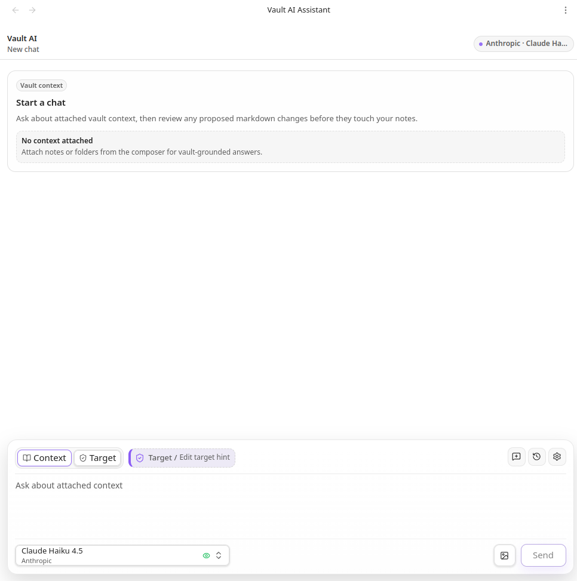

# Vault AI Assistant

Vault AI Assistant is an Obsidian plugin that adds an AI chat assistant for working with explicitly attached vault context. It can answer questions about notes and folders you provide, and it can propose vault file changes for your approval before anything is written.

This is an alpha release. Use it on a test vault first and review proposed file changes carefully.

## Preview



## Features

- Chat with OpenAI or Anthropic models from inside Obsidian.
- Open the assistant in the sidebar or in an editor tab.
- Attach notes, folders, the active note, and images as explicit request context.
- Optionally auto-attach the active note and use its folder as the default edit target.
- Add edit target hints so the assistant knows where you intend vault changes to go without sending hidden folder contents as readable context.
- Review approval-gated vault operation proposals before writes happen.
- Supported approved operations include creating folders, creating notes, modifying notes, appending notes, deleting notes/folders, moving or renaming notes/folders, and copying notes.
- Built-in system prompts can be edited from markdown files under `vault-ai-assistant/system-prompts`.
- Custom markdown files added under `vault-ai-assistant/system-prompts` appear as selectable system prompts in chat settings.
- Saved chat history is stored locally in the vault under `vault-ai-assistant/conversations`.

## Context and Edit Targets

Vault AI Assistant separates readable context from edit targets.

Context is the material the model can read. When you attach notes, folders, the active note, or images as context, their contents are included in the provider request so the assistant can answer from them or use them while drafting a proposal.

Edit targets are path hints for where requested vault changes should happen. A target can be a note, a folder, or the default vault root target shown as `Target /`. Target-only folders and notes do not send hidden file contents to the model unless you also attach them as readable context.

A folder can be used in both ways: attach it as context when the assistant needs to read the files inside it, or set it as an edit target when you only want to indicate where new or changed files should go. Edit targets are not direct write permission; every vault operation still appears as an approval card and nothing is written until you approve it.

## Safety Model

Vault AI Assistant does not independently search or read your whole vault. The model receives only the context you explicitly attach, the active note if you enable automatic active-note context, prior chat history included in the request, image attachments you send, and non-readable edit target path hints.

Vault writes are approval-gated. When the assistant wants to change the vault, it creates a proposal card first. You can inspect the paths, previews, and diffs before applying or rejecting operations. No proposed operation is written until you approve it.

The plugin performs validation and preflight checks for unsafe paths, unsupported operations, stale baselines, missing files, duplicate creates, destination collisions, and already-satisfied no-op changes. These checks reduce risk, but they are not a substitute for reviewing proposed changes.

## Network and Data Disclosure

This plugin connects directly to AI providers you configure:

- OpenAI API endpoints for OpenAI models.
- Anthropic API endpoints for Anthropic models.

Requests are sent using your configured provider API key. API keys are referenced through Obsidian SecretStorage.

The data sent to the selected provider may include:

- Your current chat message.
- Prior chat messages needed for conversation continuity.
- Contents of notes or folders you explicitly attach as readable context.
- Contents of the active markdown note when `Auto attach active note` is enabled.
- Image attachments you explicitly send.
- Edit target path hints, such as folder or note paths, without hidden file contents unless those files are also attached as context.
- Proposed operation history paths and statuses when needed for follow-up grounding.

The plugin does not run its own backend service and does not intentionally collect analytics or telemetry. Provider-side retention, logging, and training behavior are controlled by the provider and your provider account settings.

## Setup

1. Install and enable the plugin in an Obsidian vault.
2. Open Obsidian settings and go to Vault AI Assistant.
3. Add or select an OpenAI or Anthropic API key in Obsidian SecretStorage.
4. Choose a model from the chat composer.
5. Attach readable context, set an edit target if you want the assistant to propose vault changes, and send a message.

For first use, test in a non-critical vault so you can validate the approval flow safely.

## Limitations

- The assistant can only ground vault-specific answers in context you provide.
- Folder copy is not supported in this alpha.
- The plugin can propose broad modifications if you ask for them; review diffs before applying.
- AI provider responses may be incomplete or incorrect. The plugin validates operation shape and file safety, but it cannot guarantee model reasoning quality.
- Mobile UI is supported, but complex review flows are easier to inspect on desktop.

## Development

Install dependencies:

```bash
npm install
```

Run checks:

```bash
npm test
npm run build
npm run lint
```

Run a development watcher:

```bash
npm run dev
```

## Test Vault Setup

Use a dedicated Obsidian test vault for development. Do not develop this plugin against your main vault.

Set `TEST_VAULT_PLUGIN_DIR` to the plugin folder inside that vault:

```bash
export TEST_VAULT_PLUGIN_DIR=/path/to/TestVault/.obsidian/plugins/vault-ai-assistant
npm run build
npm run copy:plugin
```

Then open Obsidian, enable community plugins, and enable Vault AI Assistant in the test vault.

Before controlled alpha or beta testing, run the checklist in `docs/manual-validation.md`.
